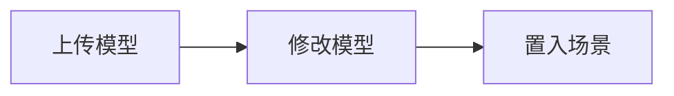

第一次进入编辑器时，我们会看到一个背景是大气散射的空场景，我们需要置入模型来搭建场景。编辑器提供了两种方式置入模型：

## 1. 内置几何体

引擎通过 [Mesh Renderer 组件](${docs}mesh-renderer) 绘制几何体，编辑器已经内置了`立方体`、`球`、`圆柱体` 等基础几何体，可以直接在左侧节点树点击 `+` 置入模型：

当然，我们也可以在组件面板点击 `1` 添加 `Mesh Renderer`组件，点击 `2` 绑定想要的基础几何体：

组件属性：

| 属性            | 说明                                                          |
| --------------- | ------------------------------------------------------------- |
| Mesh            | 选取项目中的网格，描述顶点信息（位置，拓扑，顶点颜色，UV 等） |
| Material        | 选取项目中的材质，描述材质信息                                |
| receiveShadows  | 当前渲染器是否接受阴影（默认接受）                            |
| castShadows     | 当前渲染器是否投射阴影（默认投射）                            |
| Render Priority | 渲染优先级，默认 0，数字越大，越后渲染                        |

## 2. 建模软件导出

编辑器目前支持导入 `glTF` 或者 `FBX` 格式的模型，但是最后编辑器都会转换成运行时也可以解析的[ glTF 格式](${docs}gltf-cn)。

### 上传模型

- **准备模型资源**
  - 使用 [Blender](https://docs.blender.org/manual/en/2.80/addons/io_scene_gltf2.html) 等建模软件导出
  - 使用 [Sketchfab](https://sketchfab.com/) 等模型网站下载

- **上传模型** ，可以选择以下两种方式上传：
  - 直接把模型文件，或者压缩成 **.zip** 后拖进资源面板:（**推荐**） 
  

  - 也可以在资源面板中点击上传按钮： 
  

- **预览模型相关资产。** 模型上传成功后，模型资源的网格、贴图、动画、材质等内容都会被展示在资源面板当中：

如果素材很多，还可以使用编辑器的筛选/查找功能:  

### 修改模型

一般情况下，模型已经自带动画和材质，用户可以不用做任何操作；但是在一定场景下，开发者可能想要手动微调材质，比如修改颜色，那么我们可以将原材质进行复制，即点击 `duplicate & remap`，然后就可以在原材质参数的基础上进行修改：

- 更多材质调试详见 [材质教程](${docs}editor-3d-material-cn)。
- 更多动画编辑详见 [动画教程](${docs}editor-animator-cn)。

### 置入场景

上传和修改完模型资源之后，场景并不会自动渲染该模型，我们还需要将模型资源拖拽到场景中：

