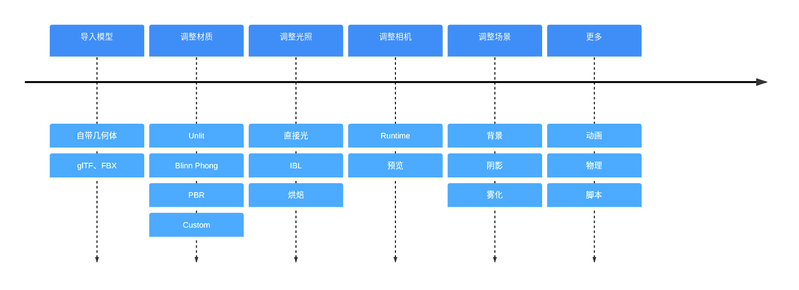

我们在前面的[快速上手教程](${docs}editor-cn)中，通过一个简单的【旋转的立方体】小 demo，初步了解到一个 3D 项目的制作流程，但是在实际业务中，如何搭建一个精美的场景，还牵扯到很多**模型、材质、光照、相机、场景配置**等重要环节，我们接下来会就这些环节分别展开讨论。

## 相关流程

> 各个环节没有严格的顺序要求，并且每个环节之间可能需要多次反馈调整

```mermaid
%%{init: { 'timeline': {'disableMulticolor': true} , 'themeVariables': {
              'cScale0': '#3F8EF8'
       } } }%%
timeline
    导入模型 : 自带几何体
            : glTF、FBX
    调整材质 : Unlit
			: Blinn Phong
			: PBR
			: Custom
    调整光照 : 直接光
			: IBL
			: 烘焙
    调整相机 : Runtime
			: 预览
    调整场景 : 背景
			: 阴影
			: 雾化
	更多     : 动画
			: 物理
			: 脚本
```
