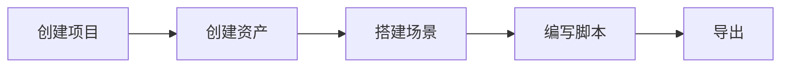

## 简介

[Galacean Editor](https://antg.antgroup.com/editor) 是一个基于移动优先的高性能开源互动引擎 [Galacean Engine](https://github.com/galacean/engine) 的云端 Web 互动创作平台。它可以帮助你快速的创建、编辑和导出一个互动项目。你可以通过 Galacean Editor 快速上传互动资产，创建和编辑材质、调整灯光、创建实体，从而创造出复杂的场景。你可以实现自己的创意想法，将自己的创意变成一个互动的现实。总之，使用 Galacean Editor，你可以在开发过程中节省大量时间和精力，从而创造出更具创意性和交互性的互动作品。

## 认识编辑器

### 使用流程

在认识编辑器各模块之前，我们先了解一下使用编辑器创建互动项目的整体流程：



这里以一个最简单的 3D 场景为例，带你认识一下整个编辑器的使用方法。

### 首页

在你登录之后，首先看到的是编辑器的首页，在这个页面中会显示所有你创建的项目。使用右上角的按钮来创建项目，点击后可以选择要创建的项目类型，2D 或 3D。首先，我们来创建一个 3D 项目。


### 编辑器界面

下面你看到的是编辑器的主界面


| 序号 | 面板                                         | 说明                                                         |
| ---- | -------------------------------------------- | ------------------------------------------------------------ |
| 1    | 侧边栏                                   | 包含了编辑器的主菜单，面板切换按钮以及个性化设置             |
| 2    | [层级面板](${docs}editor-hierarchy-cn)   | 位于编辑器左侧，在这里会显示整个场景中的所有节点             |
| 3    | [资产面板](${docs}editor-assets-cn)      | 位于编辑器底部，其中会显示当前项目所包含的所有资产，如 HDR 贴图、各种纹理文件、脚本、字体文件等 |
| 4    | [检查器面板](${docs}editor-inspector-cn) | 位于编辑器右侧，会根据你的当前选择二显示不同编辑选项         |
| 5    | [主编辑区](${docs}editor-viewport-cn)    | 位于编辑器中间，是编辑器的主要操作区域，可以通过鼠标和键盘来编辑场景 |
| 6    | 工具栏                                       | 位于编辑器顶部，这里提供了一些快速的操作如切换 Gizmo 的模式、切换场景视角，相机配置等 |
| 7    | 相机预览区                                   | 位于主编辑区域的左下角，在这里可以以当前选中的相机为视角来预览场景 |

对于各个面板详细的介绍可以点击上方链接查看。接下来，我们来看看具体如何实现一个「旋转的立方体」项目。

### 创建立方体

首先，我们在 **层级面板** 中创建一个新的实体（[什么是实体？](https://galacean.antgroup.com/#/docs/latest/cn/entity)）。


我们用鼠标左键选中新建的实体节点，此时右侧的检查器面板会显示出当前实体的一些可配置属性。因为我们的实体现在没有绑定任何组件（[什么是组件？](https://galacean.antgroup.com/#/docs/latest/cn/entity)），所以我们暂时只能调整实体的坐标信息这类的基础属性。

接下来，我们点击检查器面板中的 `Add Component` 按钮唤起组件选单，然后选择添加 `Mesh Renderer` 组件（什么是 [Mesh Renderer?](https://galacean.antgroup.com/#/docs/latest/cn/mesh-renderer)）。


这样，我们就给当前的实体新增了一个 `Mesh Renderer` 组件。但我们在主编辑区还看不到这个物体。需要为该组件添加 Mesh 和 Material 才行。编辑器会默认为 `Mesh Renderer` 组件添加一个不可编辑的默认材质，我们只需要为组件的 Mesh 属性添加一个 Cuboid Mesh 就可以在场景中看到它了。


默认的材质比较简单，所以接下来，我们来创建一个自定义的材质。

你也可以通过添加实体按钮中的 `3D Object` → `Cuboid` 来快速添加一个立方体模型，它会自动帮你添加一个 `Mesh Renderer` 组件：


### 创建材质

首先，我们来上传纹理。我们可以把这些纹理文件直接拖动到 **资产管理面板，** 既可批量上传这些文件。

上传后，我们可以在面板中看到这些文件，依次是粗糙度纹理、法线纹理、基础颜色纹理。


我们首先在 **资产管理面板** 中依次选择 `右键` → `Create` → `Material` 让编辑器会创建出一个默认的 PBR 材质。我们选中这个材质，此时检查器面板会显示当前材质的配置选项。默认的材质比较简单，我们可以为这个材质增加一些纹理贴图，如基础纹理、粗糙度纹理、法线贴图。


接下来，我们把这些贴图配置到材质的对应属性当中。配置后我们再次选择上一步创建的实体节点，将 `Mesh Renderer` 组件的 `Material` 属性修改为我们刚刚创建的自定义材质。一个拥有金属质感的立方体就创建成功了。


只不过，立方体现在看上去有点暗，需要把场景中的 [灯光](https://galacean.antgroup.com/#/docs/latest/cn/light) 调亮一点。我们在节点树中选择 `DirectLight` 节点，然后在检查器中调高 `Intensity`（光强度）属性。

现在看上去就比较正常了。


## 添加脚本

接下来，我们为这个节点再绑定一个 `Script` 组件（[什么是 Script 组件?](https://galacean.antgroup.com/#/docs/latest/cn/script)）。

1. 我们继续使用上述方式在检查器面板中添加 `Script` 组件
2. 接下来，我们在资产面板中 `右键` →` Create` → `Script`  创建一个 `Script` 资产
3. 最后，在检查器面板中将刚创建的脚本文件绑定到脚本组件上

> ⚠️ 注意，如果你没有把脚本资产绑定到实体的脚本组件上，则脚本不会运行

创建脚本后，我们可以 **双击它** 来跳转到代码编辑器页面。


进入代码编辑器后，我们写一个非常简单的旋转功能：

```ts
// Script.ts
import { Script } from '@galacean/engine';

export default class extends Script {
  onUpdate(deltaTime: number) {
    this.entity.transform.rotate(1,1,1);
  }
}
```

在写好代码后，保存（`⌘+s`）, 右侧预览区就可以实时的看到整个场景的效果。

## 导出项目

现在，我们已经完成了在编辑器中的基础开发工作，接下来我们来导出这个项目到本地。

我们点击左侧工具栏的 **下载** 按钮，会唤起导出界面，我们这里把项目名改为 “box”，然后点击 `Download` 按钮，编辑器就会把项目打包为一个 `box.zip` 文件下载。


## 运行项目

项目打包完成后，我们使用 VsCode 打开 box 项目，运行 `npm install` &  `npm run dev` ，可以看到项目已经能够正常运行了。