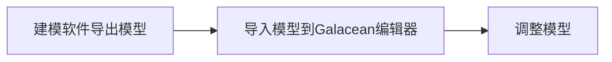

# 模型

模型通常指的是由设计师通过三维建模软件创建的，包含一系列[网格](${docs})，[材质](${docs})，[纹理](${docs})和[动画](${docs})信息的三维模型，在 Galacean 中，它也被视作一种资产，模型资产工作流通常如下：



本章主要解答如下开发者可能遇到的问题：

- 模型格式的要求，编辑器目前支持导入 `glTF` 或者 `FBX` 格式的模型，但是最后编辑器都会转换成运行时也可以解析的[ glTF 格式](${docs}graphics-model-glTF)。
- [导入模型到编辑器](${docs}graphics-model-importGlTF)
- 什么是[模型资产](${docs}graphics-model-assets)
- [模型资产的加载与使用](${docs}graphics-model-use)
- [在编辑器中还原美术效果](${docs}graphics-model-restoration)
- [模型的优化](${docs}graphics-model-opt)

## 内置几何体

常用几何体统一在 [PrimitiveMesh](${api}core/PrimitiveMesh) 中提供。

### 编辑器使用

编辑器已经内置了`立方体`、`球`、`圆柱体` 等基础几何体，可以直接在左侧节点树点击 `+` 置入模型：


当然，我们也可以在组件面板点击 `1` 添加 `Mesh Renderer`组件，点击 `2` 绑定想要的基础几何体：


### 脚本使用

<playground src="primitive-mesh.ts"></playground>

目前提供的几何体如下：

- [createCuboid](${api}core/PrimitiveMesh#createCuboid) **立方体**

```typescript
const entity = rootEntity.createChild('cuboid');
entity.transform.setPosition(0, 1, 0);
const renderer = entity.addComponent(MeshRenderer);
renderer.mesh = PrimitiveMesh.createCuboid(engine);
// Create material
const material = new BlinnPhongMaterial(engine);
material.emissiveColor.set(1, 1, 1, 1);
renderer.setMaterial(material);
```

- [createSphere](${api}core/PrimitiveMesh#createSphere) **球体**

```typescript
const entity = rootEntity.createChild('sphere');
entity.transform.setPosition(0, 1, 0);
const renderer = entity.addComponent(MeshRenderer);
renderer.mesh = PrimitiveMesh.createSphere(engine);
// Create material
const material = new BlinnPhongMaterial(engine);
material.emissiveColor.set(1, 1, 1, 1);
renderer.setMaterial(material);
```

- [createPlane](${api}core/PrimitiveMesh#createPlane) **平面**

```typescript
const entity = rootEntity.createChild('plane');
entity.transform.setPosition(0, 1, 0);
const renderer = entity.addComponent(MeshRenderer);
renderer.mesh = PrimitiveMesh.createPlane(engine);
// Create material
const material = new BlinnPhongMaterial(engine);
material.emissiveColor.set(1, 1, 1, 1);
renderer.setMaterial(material);
```

- [createCylinder](${api}core/PrimitiveMesh#createCylinder) **圆柱**

```typescript
const entity = rootEntity.createChild('cylinder');
entity.transform.setPosition(0, 1, 0);
const renderer = entity.addComponent(MeshRenderer);
renderer.mesh = PrimitiveMesh.createCylinder(engine);
// Create material
const material = new BlinnPhongMaterial(engine);
material.emissiveColor.set(1, 1, 1, 1);
renderer.setMaterial(material);
```

- [createTorus](${api}core/PrimitiveMesh#createTorus) **圆环**

```typescript
const entity = rootEntity.createChild('torus');
entity.transform.setPosition(0, 1, 0);
const renderer = entity.addComponent(MeshRenderer);
renderer.mesh = PrimitiveMesh.createTorus(engine);
// Create material
const material = new BlinnPhongMaterial(engine);
material.emissiveColor.set(1, 1, 1, 1);
renderer.setMaterial(material);
```

- [createCone](${api}core/PrimitiveMesh#createCone) **圆锥**

```typescript
const entity = rootEntity.createChild('cone');
entity.transform.setPosition(0, 1, 0);
const renderer = entity.addComponent(MeshRenderer);
renderer.mesh = PrimitiveMesh.createCone(engine);
// Create material
const material = new BlinnPhongMaterial(engine);
material.emissiveColor.set(1, 1, 1, 1);
renderer.setMaterial(material);
```

- [createCapsule](${api}core/PrimitiveMesh#createCapsule) **胶囊体**

```typescript
const entity = rootEntity.createChild('capsule');
entity.transform.setPosition(0, 1, 0);
const renderer = entity.addComponent(MeshRenderer);
renderer.mesh = PrimitiveMesh.createCapsule(engine);
// Create material
const material = new BlinnPhongMaterial(engine);
material.emissiveColor.set(1, 1, 1, 1);
renderer.setMaterial(material);
```