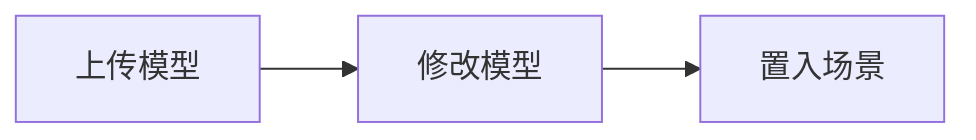

## 建模软件导出

编辑器目前支持导入 `glTF` 或者 `FBX` 格式的模型，但是最后编辑器都会转换成运行时也可以解析的[ glTF 格式](${docs}gltf-cn)。



> glTF（GL Transmission Format）是 [khronos](https://www.khronos.org/) 发布的一种能高效传输和加载 3D 场景的规范，与 FBX、OBJ 等传统模型格式一样，基本支持 3D 场景中的所有特性，也是目前 Galacean 推荐的首选 3D 文件格式。glTF 的产物一般分为（.gltf + .bin + png）或者 (.glb)，前者适合图片体积大的场景，所以将图片和模型拆分开来，可以异步加载模型和纹理；后者适合模型文件较大的场景，会将所有数据进行二进制保存，需要等所有数据解析完毕才能展示模型。

### 编辑器使用

1. 准备模型资源**

模型使用 [Blender](https://docs.blender.org/manual/en/2.80/addons/io_scene_gltf2.html) 等建模软件导出 Fbx 或 glTF 格式，也可从 [Sketchfab](https://sketchfab.com/) 等模型网站下载。

2. 上传模型。可以选择以下两种方式上传：

直接把模型文件，或者压缩成 **.zip** 后拖进资源面板:（**推荐**） 


也可以在资源面板中点击上传按钮： 


3. 预览模型相关资产。模型上传成功后，模型资源的网格、贴图、动画、材质等内容都会被展示在资源面板当中：

  

4. 修改模型。一般情况下，模型已经自带动画和材质，用户可以不用做任何操作；但是在一定场景下，开发者可能想要手动微调材质，比如修改颜色，那么我们可以将原材质进行复制，即点击 `duplicate & remap`，然后就可以在原材质参数的基础上进行修改：


5. 置入场景。上传和修改完模型资源之后，场景并不会自动渲染该模型，我们还需要将模型资源拖拽到场景中：


### 脚本使用

加载一个 3D 模型只要调用引擎 [ResourceManager](${docs}resource-manager-cn) 实例的 [load](${api}core/ResourceManager/#load) 方法即可，如下：

```typescript
engine.resourceManager.load("{glTF source}").then((gltf) => {
  entity.addChild(gltf.defaultSceneRoot);
});
```

如果在一个异步函数体中使用，可以采用 `async/await` 语法：

```typescript
const gltf = await this.engine.resourceManager.load("{glTF source}");

entity.addChild(gltf.defaultSceneRoot);
```

如下 demo：

<playground src="gltf-basic.ts"></playground>

glTF 拥有非常多的特性，官网提供了大量的[示例](https://github.com/KhronosGroup/glTF-Sample-Models/tree/master/2.0)进行参考，Galacean 也提供了一份复刻版本进行快速浏览，可以通过以下 **glTF List** 切换不同的 glTF 模型。

前往[ glTF 资源](${docs}gltf-cn) 了解更多 glTF 相关设计。

<playground src="gltf-loader.ts"></playground>

## 内置几何体

常用几何体统一在 [PrimitiveMesh](${api}core/PrimitiveMesh) 中提供。

### 编辑器使用

编辑器已经内置了`立方体`、`球`、`圆柱体` 等基础几何体，可以直接在左侧节点树点击 `+` 置入模型：


当然，我们也可以在组件面板点击 `1` 添加 `Mesh Renderer`组件，点击 `2` 绑定想要的基础几何体：


### 脚本使用

<playground src="primitive-mesh.ts"></playground>

目前提供的几何体如下：

- [createCuboid](${api}core/PrimitiveMesh#createCuboid) **立方体**

```typescript
const entity = rootEntity.createChild('cuboid');
entity.transform.setPosition(0, 1, 0);
const renderer = entity.addComponent(MeshRenderer);
renderer.mesh = PrimitiveMesh.createCuboid(engine);
// Create material
const material = new BlinnPhongMaterial(engine);
material.emissiveColor.set(1, 1, 1, 1);
renderer.setMaterial(material);
```

- [createSphere](${api}core/PrimitiveMesh#createSphere) **球体**

```typescript
const entity = rootEntity.createChild('sphere');
entity.transform.setPosition(0, 1, 0);
const renderer = entity.addComponent(MeshRenderer);
renderer.mesh = PrimitiveMesh.createSphere(engine);
// Create material
const material = new BlinnPhongMaterial(engine);
material.emissiveColor.set(1, 1, 1, 1);
renderer.setMaterial(material);
```

- [createPlane](${api}core/PrimitiveMesh#createPlane) **平面**

```typescript
const entity = rootEntity.createChild('plane');
entity.transform.setPosition(0, 1, 0);
const renderer = entity.addComponent(MeshRenderer);
renderer.mesh = PrimitiveMesh.createPlane(engine);
// Create material
const material = new BlinnPhongMaterial(engine);
material.emissiveColor.set(1, 1, 1, 1);
renderer.setMaterial(material);
```

- [createCylinder](${api}core/PrimitiveMesh#createCylinder) **圆柱**

```typescript
const entity = rootEntity.createChild('cylinder');
entity.transform.setPosition(0, 1, 0);
const renderer = entity.addComponent(MeshRenderer);
renderer.mesh = PrimitiveMesh.createCylinder(engine);
// Create material
const material = new BlinnPhongMaterial(engine);
material.emissiveColor.set(1, 1, 1, 1);
renderer.setMaterial(material);
```

- [createTorus](${api}core/PrimitiveMesh#createTorus) **圆环**

```typescript
const entity = rootEntity.createChild('torus');
entity.transform.setPosition(0, 1, 0);
const renderer = entity.addComponent(MeshRenderer);
renderer.mesh = PrimitiveMesh.createTorus(engine);
// Create material
const material = new BlinnPhongMaterial(engine);
material.emissiveColor.set(1, 1, 1, 1);
renderer.setMaterial(material);
```

- [createCone](${api}core/PrimitiveMesh#createCone) **圆锥**

```typescript
const entity = rootEntity.createChild('cone');
entity.transform.setPosition(0, 1, 0);
const renderer = entity.addComponent(MeshRenderer);
renderer.mesh = PrimitiveMesh.createCone(engine);
// Create material
const material = new BlinnPhongMaterial(engine);
material.emissiveColor.set(1, 1, 1, 1);
renderer.setMaterial(material);
```

- [createCapsule](${api}core/PrimitiveMesh#createCapsule) **胶囊体**

```typescript
const entity = rootEntity.createChild('capsule');
entity.transform.setPosition(0, 1, 0);
const renderer = entity.addComponent(MeshRenderer);
renderer.mesh = PrimitiveMesh.createCapsule(engine);
// Create material
const material = new BlinnPhongMaterial(engine);
material.emissiveColor.set(1, 1, 1, 1);
renderer.setMaterial(material);
```