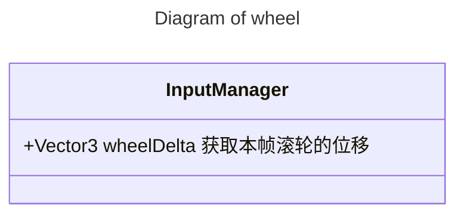

Galacean 的滚轮输入是基于 [WheelEvent](https://www.w3.org/TR/uievents/#interface-wheelevent) 实现的。

## 使用

```mermaid
---
title: Diagram of wheel
---
classDiagram
    class InputManager
    InputManager: +Vector3 wheelDelta 获取本帧滚轮的位移
```

可以依此实现用滚轮控制相机距离的示例。

<playground src="input-wheel.ts"></playground>
