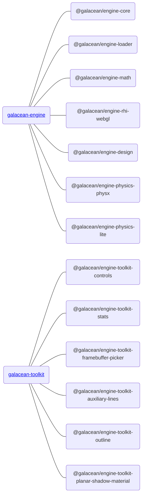

**Galacean Engine** is a set of web first and mobile first interactive engine, using [Typescript](https://www.typescriptlang.org/) Written.The core functions are provided by [Galacean Engine](https://www.npmjs.com/package/@galacean/engine), and the advanced functions of non core and partial business logic customization are provided by [Galacean Toolkit](https://github.com/galacean/engine-toolkit).

<a href="https://github.com/ant-galaxy/oasis-engine/stargazers" target='_blank'>
   
</a>
<a href="https://www.npmjs.com/package/oasis-engine" target='_blank'>
   
</a>

## How to Install

### NPM

 It is recommended to install them through [NPM](https://docs.npmjs.com/):

1. Install 

   Engine

```bash
npm install --save @galacean/engine
```

Engine toolkit

```bash
npm install --save @galacean/engine-toolkit-controls
```


2. import 

   Engine

```typescript
import { WebGLEngine, Camera } from "@galacean/engine";
```

Engine toolkit

```typescript
import { OrbitControl } from "@galacean/engine-toolkit-controls";

```


### Create Galacean App

If you just want to quickly create a project, it is recommended that you use [create-galacean-app](https://github.com/galacean/create-galacean-app), which provides some commonly used frameworks such as [ React](https://reactjs.org/), [Vue](https://vuejs.org/) and other templates. Examples of usage are as follows:


## Package structure

The core architecture logic and core functions of the engine are provided by Galacean Engine, including the following sub packages:



### Engine package
Engine core architecture logic and core functions ([Galacean Engine](https://www.npmjs.com/package/@galacean/engine)), including the following sub-packages:

|Main Package|Explanation|API|
|:--|:--|--|
|[@galacean/engine-core](https://www.npmjs.com/package/@galacean/engine-core)| Engine core, such as component system |[API](${api}core/index)|
|[@galacean/engine-loader](https://www.npmjs.com/package/@galacean/engine-loader)| Resource loading |[API](${api}loader/index)|
|[@galacean/engine-rhi-webgl](https://www.npmjs.com/package/@galacean/engine-rhi-webgl)| WebGL Rendering Hardware Interface|[API](${api}rhi-webgl/index)|
|[@galacean/engine-math](https://www.npmjs.com/package/@galacean/engine-math)| Math Library |[API](${api}math/index)|
|[@galacean/engine-design](https://www.npmjs.com/package/@galacean/engine-design)| Engine basic design specifications, such as cloning specifications, destruction specifications, RHI specifications|[API](${api}design/index)|
|[@galacean/engine-physics-lite](https://www.npmjs.com/package/@galacean/engine-physics-lite)| Lightweight physics engine |[API](${api}physics-lite/index)|
|[@galacean/engine-physics-physx](https://www.npmjs.com/package/@galacean/engine-physics-physx)| Full-featured physics engine |[API](${api}physics-physx/index)|
|[@galacean/engine-draco](https://www.npmjs.com/package/@galacean/engine-draco)| Draco model compression |[API](${api}draco/index)|


### Engine tookit package

Non core functions and partial business logic customization functions are provided by Galacean Engine toolkit package:

Please check the list of completed functions https://github.com/galacean/engine-toolkit/tree/main

|Expansion Pack|Explanation|API|
|:--|:--|:--|
|[@galacean/engine-toolkit-controls](https://www.npmjs.com/package/@galacean/engine-toolkit-controls)| Controller |[Doc](${docs}controls)|
|[@galacean/engine-toolkit-framebuffer-picker](https://www.npmjs.com/package/@galacean/engine-toolkit-framebuffer-picker)| Framebuffer Picking|[Doc](${docs}framebuffer-picker)|
|[@galacean/engine-toolkit-stats](https://www.npmjs.com/package/@galacean/engine-toolkit-stats)| Engine Statistics Panel |[Doc](${docs}stats)|
|......|  ||


### Else

| Expansion Pack                                               | Explanation      | API                  |
| :----------------------------------------------------------- | :--------------- | :------------------- |
| [@galacean/engine-spine](https://www.npmjs.com/package/@galacean/engine-spine) | Spine Animation  | [Doc](${docs}spine)  |
| [@galacean/engine-lottie](https://www.npmjs.com/package/@galacean/engine-lottie) | Lottie Animation | [Doc](${docs}lottie) |

## Replace Oasis with Galacean

If your project is being developed using Oasis and you want to upgrade to Galacean, you can refer to the following steps:

### Run Script

```bash
// Contributed by @crazylxr
npx galacean-codemod
```

### update dependencies

```bash
rm -rf ./node_modules  && npm install
```

PS: Executing the `galacean-codemod` command will be configured according to [`packageReplacements`](https://github.com/crazylxr/galacean-codemod/blob/main/src/packageReplacements.json):
- Traverse the script files in the `src` folder in the same directory to replace `import` references
- Update the `package.json` file in the same directory to update dependencies
- The original project directory will not be modified, and no dependencies will be added
- After the automatic replacement, the developer needs to check whether the project is running correctly
- If there are any omissions or optimizations, please submit [ISSUE](https://github.com/crazylxr/galacean-codemod/issues) or [PR](https://github.com/crazylxr/galacean-codemod/pulls)