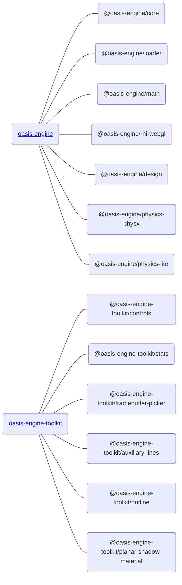

## How to Install

### NPM

**Oasis engine** is a set of web first and mobile first interactive engine, using [Typescript](https://www.typescriptlang.org/) Written.The core functions are provided by [oasis-engine](https://www.npmjs.com/package/oasis-engine), and the advanced functions of non core and partial business logic customization are provided by [oasis-engine-toolkit](https://github.com/oasis-engine/engine-toolkit). It is recommended to install them through [NPM](https://docs.npmjs.com/):

1. Install 

   Engine

```bash
npm install --save oasis-engine
```

Engine toolkit

```bash
npm install --save oasis-engine-toolkit
```


2. import 

   Engine

```typescript
import { WebGLEngine, Camera } from 'oasis-engine';
```

Engine toolkit

```typescript
import { OrbitControl, Stats } from 'oasis-engine-toolkit';
```


### Create Oasis App

If you just want to quickly create a project, it is recommended that you use [create-oasis-app](https://github.com/oasis-engine/create-oasis-app), which provides some commonly used frameworks such as [ React](https://reactjs.org/), [Vue](https://vuejs.org/) and other templates. Examples of usage are as follows:


## Package structure

The core architecture logic and core functions of the engine are provided by oasis engine, including the following sub packages:



### Engine package
Engine core architecture logic and core functions ([oasis-engine](https://www.npmjs.com/package/oasis-engine)), including the following sub-packages:

|Main Package|Explanation|API|
|:--|:--|--|
|[@oasis-engine/core](https://www.npmjs.com/package/@oasis-engine/core)| Engine core, such as component system |[API](${api}core/index)|
|[@oasis-engine/loader](https://www.npmjs.com/package/@oasis-engine/loader)| Resource loading |[API](${api}loader/index)|
|[@oasis-engine/rhi-webgl](https://www.npmjs.com/package/@oasis-engine/rhi-webgl)| WebGL Rendering Hardware Interface|[API](${api}rhi-webgl/index)|
|[@oasis-engine/math](https://www.npmjs.com/package/@oasis-engine/math)| Math Library |[API](${api}math/index)|
|[@oasis-engine/design](https://www.npmjs.com/package/@oasis-engine/design)| Engine basic design specifications, such as cloning specifications, destruction specifications, RHI specifications|[API](${api}design/index)|
|[@oasis-engine/physics-lite](https://www.npmjs.com/package/@oasis-engine/physics-lite)| Lightweight physics engine |[API](${api}physics-lite/index)|
|[@oasis-engine/physics-physx](https://www.npmjs.com/package/@oasis-engine/physics-physx)| Full-featured physics engine |[API](${api}physics-physx/index)|
|[@oasis-engine/draco](https://www.npmjs.com/package/@oasis-engine/draco)| Draco model compression |[API](${api}draco/index)|


### Engine tookit package

Non core functions and partial business logic customization functions are provided by oasis engine toolkit package:

Please check the list of completed functions https://github.com/oasis-engine/engine-toolkit/tree/main

|Expansion Pack|Explanation|API|
|:--|:--|:--|
|[@oasis-engine-toolkit/controls](https://www.npmjs.com/package/@oasis-engine-toolkit/controls)| Controller |[Doc](${docs}controls)|
|[@oasis-engine-toolkit/framebuffer-picker](https://www.npmjs.com/package/@oasis-engine-toolkit/framebuffer-picker)| Framebuffer Picking|[Doc](${docs}framebuffer-picker)|
|[@oasis-engine-toolkit/stats](https://www.npmjs.com/package/@oasis-engine-toolkit/stats)| Engine Statistics Panel |[Doc](${docs}stats)|
|......|  ||


### Else

| Expansion Pack                                               | Explanation      | API                  |
| :----------------------------------------------------------- | :--------------- | :------------------- |
| [@oasis-engine/engine-spine](https://www.npmjs.com/package/@oasis-engine/engine-spine) | Spine Animation  | [Doc](${docs}spine)  |
| [@oasis-engine/lottie](https://www.npmjs.com/package/@oasis-engine/lottie) | Lottie Animation | [Doc](${docs}lottie) |