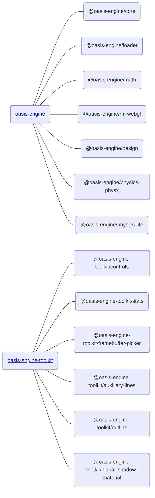

## 安装方式

### NPM

**Oasis Engine** 是一套 Web 为先，移动优先的互动引擎，使用 [Typescript](https://www.typescriptlang.org/) 编写。核心功能由 [oasis-engine](https://www.npmjs.com/package/oasis-engine) 提供，非核心和偏业务逻辑定制的高级功能由 [oasis-engine-toolkit](https://github.com/oasis-engine/engine-toolkit) 提供，推荐通过 [NPM](https://docs.npmjs.com/) 的方式进行安装：

1. 安装

   Engine 

```bash
npm install --save oasis-engine
```

​	  Engine toolkit 

```bash
npm install --save oasis-engine-toolkit
```


2. 引入

   Engine

```typescript
import { WebGLEngine, Camera } from 'oasis-engine';
```

​       Engine toolkit 

```typescript
import { OrbitControl, Stats } from 'oasis-engine-toolkit';
```


### Create Oasis App

如果你只是想在本地快速完成一个 Demo， 推荐你使用 [create-oasis-app](https://github.com/oasis-engine/create-oasis-app)， 它提供了一些常用的框架如 [React](https://reactjs.org/)、[Vue](https://vuejs.org/) 等模板。使用示例如下：


## 包结构

为了保证引擎的轻量化，我们将引擎包通过 monorepo 的形式划分为：




### 引擎包
引擎核心架构逻辑和核心功能由 oasis-engine 提供，包含以下子包：

| 功能                                                                                     | 解释                                               | API                              |
| :--------------------------------------------------------------------------------------- | :------------------------------------------------- | -------------------------------- |
| [@oasis-engine/core](https://www.npmjs.com/package/@oasis-engine/core)                   | 引擎核心，如组件系统                               | [API](${api}core/index)          |
| [@oasis-engine/loader](https://www.npmjs.com/package/@oasis-engine/loader)               | 资源加载                                           | [API](${api}loader/index)        |
| [@oasis-engine/rhi-webgl](https://www.npmjs.com/package/@oasis-engine/rhi-webgl)         | WebGL 渲染硬件接口（Rendering Hardware Interface） | [API](${api}rhi-webgl/index)     |
| [@oasis-engine/math](https://www.npmjs.com/package/@oasis-engine/math)                   | 数学库                                             | [API](${api}math/index)          |
| [@oasis-engine/design](https://www.npmjs.com/package/@oasis-engine/design)               | 引擎基础设计规范，如克隆规范、销毁规范、RHI规范    | [API](${api}design/index)        |
| [@oasis-engine/physics-lite](https://www.npmjs.com/package/@oasis-engine/physics-lite)   | 轻量级物理引擎                                     | [API](${api}physics-lite/index)  |
| [@oasis-engine/physics-physx](https://www.npmjs.com/package/@oasis-engine/physics-physx) | 全功能物理引擎                                     | [API](${api}physics-physx/index) |
| [@oasis-engine/draco](https://www.npmjs.com/package/@oasis-engine/draco)                 | Draco 模型压缩                                     | [API](${api}draco/index)         |


### 引擎工具包

非核心功能和偏业务逻辑定制功能由 oasis-engine-toolkit 包提供：

完成功能列表请查看 https://github.com/oasis-engine/engine-toolkit/tree/main

| 功能                                                                                                               | 解释         | API                              |
| :----------------------------------------------------------------------------------------------------------------- | :----------- | :------------------------------- |
| [@oasis-engine-toolkit/controls](https://www.npmjs.com/package/@oasis-engine-toolkit/controls)                     | 控制器       | [Doc](${docs}controls)           |
| [@oasis-engine-toolkit/framebuffer-picker](https://www.npmjs.com/package/@oasis-engine-toolkit/framebuffer-picker) | 帧缓冲拾取   | [Doc](${docs}framebuffer-picker) |
| [@oasis-engine-toolkit/stats](https://www.npmjs.com/package/@oasis-engine-toolkit/stats)                           | 引擎统计面板 | [Doc](${docs}stats)              |
| ......                                                                                                             |              |                                  |


### 其他

| 功能                                                                                   | 解释        | API                     |
| :------------------------------------------------------------------------------------- | :---------- | :---------------------- |
| [@oasis-engine/engine-spine](https://www.npmjs.com/package/@oasis-engine/engine-spine) | Spine 动画  | [Doc](${docs}spine-cn)  |
| [@oasis-engine/lottie](https://www.npmjs.com/package/@oasis-engine/lottie)             | Lottie 动画 | [Doc](${docs}lottie-cn) |