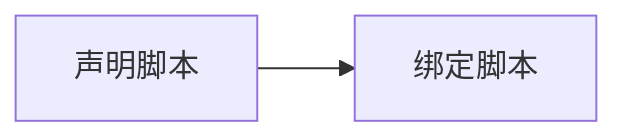

[脚本组件](${docs}script)是引擎提供给开发者的重要的扩展能力，在 Galacean 编辑器中，脚本也是一种资产。



## 声明脚本

在[脚本类](${docs}script-class)中，我们已经了解了自定义脚本的基类 [Script](${api}core/Script) ，因此，我们可以使用如下代码声明自定义脚本：

```typescript
import { Script } from "@galacean/engine";

// 声明自定义脚本
class MyScript extends Script {
  onUpdate() {}
}
```

在编辑器中可通过 `资源面板` 右上角点击 `+` 按钮，在弹出的菜单中点击 `脚本` 来声明自定义脚本：


## 绑定脚本

声明脚本后，需要将其绑定到节点上才能运行：

1. 选择你想添加脚本的实体
   

2. 在右侧的组件列表中点击 `添加组件` -> 脚本 -> 选择你之前创建的脚本
   

您也可以通过如下代码为实体绑定脚本：

```typescript
entity.addComponent(MyScript);
```
